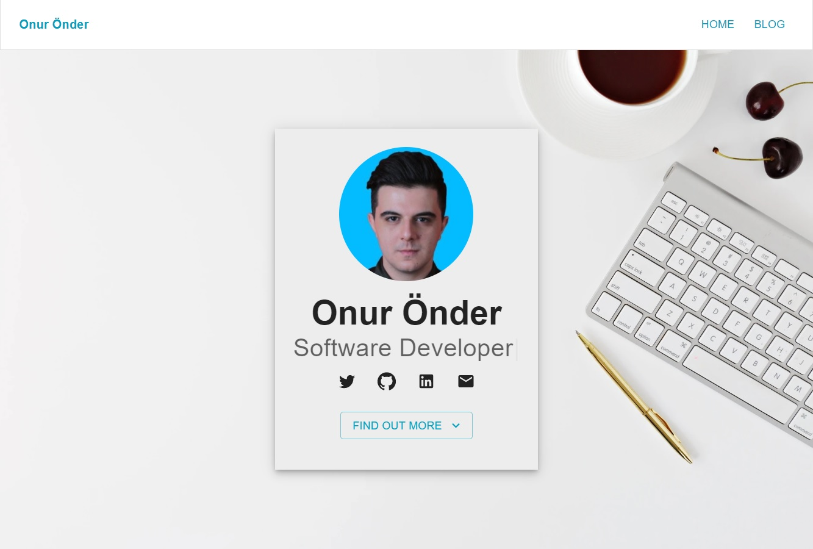

[](https://app.netlify.com/sites/frosty-perlman-9da1cb/deploys) &nbsp;

# onderonur-blog
Personal website and blog, built w/ [Gatsby][gatsby] and [Netlify CMS][netlifycms].  
Live site is **[here](https://onderonur.netlify.app/)**.  
Created by moderately modifying [gatsby-started-foundation](https://www.gatsbyjs.com/starters/stackrole/gatsby-starter-foundation/).

[](https://onderonur.netlify.app/)

## 💻 Stack
- Framework: [Gatsby](https://www.gatsbyjs.com/)
- CMS: [Netlify CMS](https://www.netlifycms.org/)
- Deployment: [Netlify](https://www.netlify.com/)
- UI components: [Material-UI](https://material-ui.com/)
- Icons: [Material-UI Icons](https://material-ui.com/components/material-icons/)
- Styling: [styled-components](https://styled-components.com/)
- Linting: [ESLint](https://eslint.org/)
- Code Formatting: [Prettier](https://prettier.io/)

## 👌 Features
- Personal website & blog
- Responsive web design
- Customize content pages
- Add/modify/delete blog posts
- Edit website settings
- Google Analytics
- SEO optimization
- OpenGraph structured data
- Twitter Cards meta
- XML Sitemaps

## Development
Navigate into your new site’s directory and start it up.
```shell
npm start
```
Your site is now running at `http://localhost:8000`!

_Note: You'll also see a second link: _`http://localhost:8000/___graphql`_. This is a tool you can use to experiment with querying your data. Learn more about using this tool in the [Gatsby tutorial](https://www.gatsbyjs.org/tutorial/part-five/#introducing-graphiql)._

You can use Netlify CMS in you local just run `npx netlify-cms-proxy-server` and start run `gatsby develop`

[gatsby]: https://gatsbyjs.org
[netlifycms]: https://www.netlifycms.org
